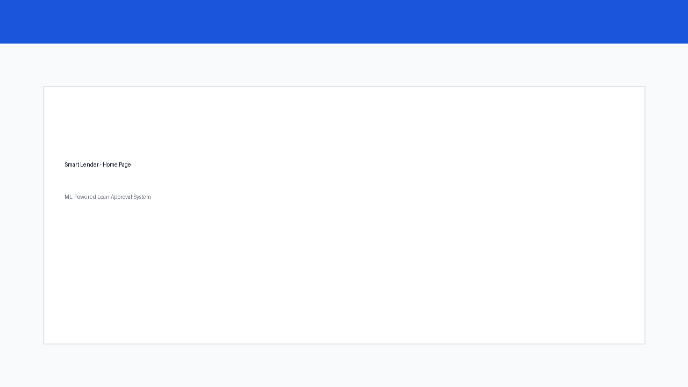
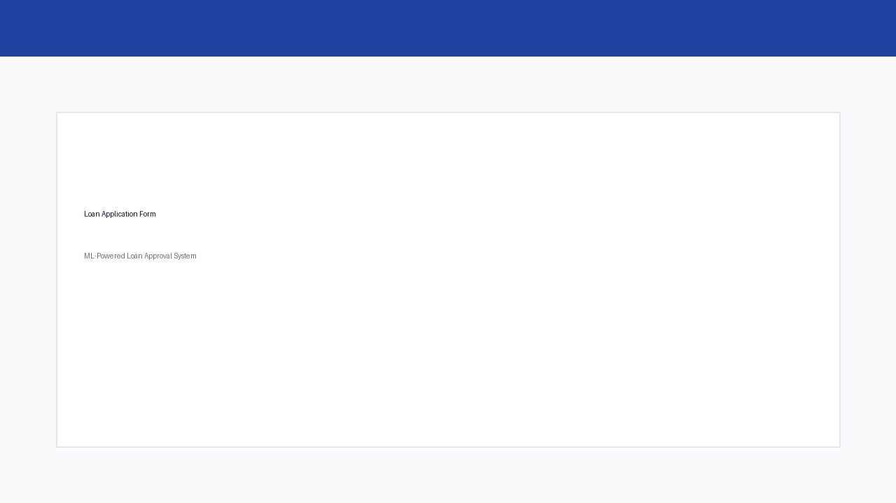
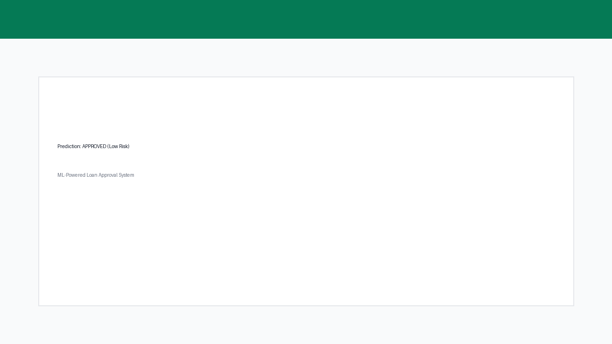
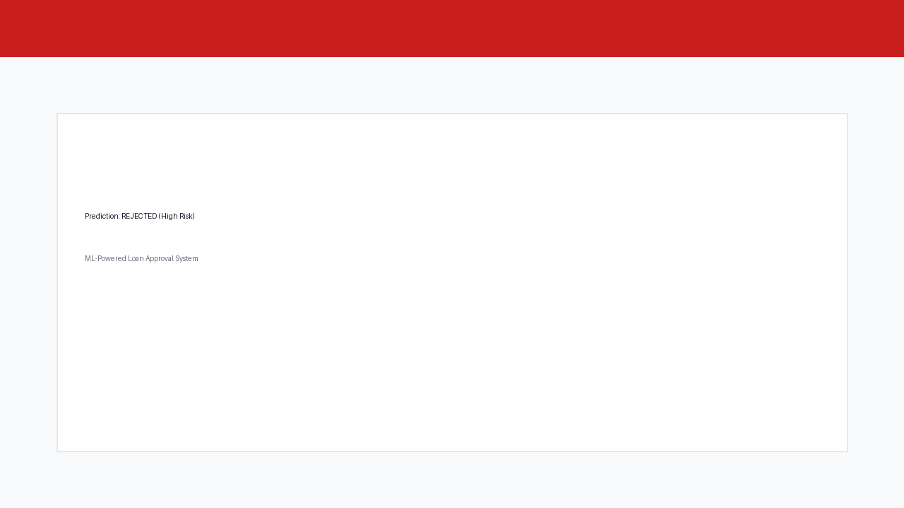

# Smart Lender

**ML-Powered Loan Approval Prediction System**

[](https://www.python.org/)
[](https://flask.palletsprojects.com/)
[](https://xgboost.readthedocs.io/)

---

## Abstract

Smart Lender is a machine learning-powered web application designed to predict the creditworthiness of loan applicants, enabling banks and financial institutions to make faster, data-driven loan approval decisions. The platform leverages four classification algorithms — Decision Tree, Random Forest, K-Nearest Neighbors (KNN), and XGBoost — to evaluate applicant data and determine the likelihood of loan repayment or default. After training and evaluating all models, the best-performing model (XGBoost) is saved and integrated into a Flask web application for real-time prediction. Built with Python and Flask and designed for deployment on IBM Cloud, Smart Lender provides a seamless user interface where applicants can submit their details and instantly receive an approval prediction.

---

## Problem Statement

Traditional loan approval processes in banks and financial institutions are often slow, manual, and inconsistent. Credit officers must review large volumes of applications, verify documents, and assess risk based on subjective judgment. This leads to:

- **Delayed approvals** for low-risk applicants who could be fast-tracked
- **Increased non-performing assets (NPAs)** when high-risk applicants slip through
- **High operational costs** during peak application periods
- **Inconsistent decisions** across different officers and branches

Smart Lender addresses these challenges by automating creditworthiness assessment using machine learning, providing instant predictions with confidence scores and risk classifications to support faster, more accurate loan decisions.

---

## Features

- **Four ML models trained and compared**: Decision Tree, Random Forest, KNN, and XGBoost
- **Best model selection**: XGBoost selected and saved for production predictions
- **Real-time web predictions**: Submit applicant details and receive instant approval/rejection
- **Confidence scores & risk levels**: Low, Moderate, High risk classifications with recommendations
- **REST API**: Programmatic batch evaluation for high-volume periods
- **IBM Cloud ready**: Procfile, manifest.yml, and Gunicorn configuration included
- **Preprocessing pipeline**: Handles missing values and categorical encoding automatically

### Model Performance

| Model | Training Accuracy | Testing Accuracy |
|-------|------------------:|-----------------:|
| Decision Tree | 93.5% | 90.9% |
| Random Forest | 94.8% | 92.2% |
| KNN | 79.6% | 81.8% |
| **XGBoost (Best)** | **96.7%** | **92.9%** |

---

## Tech Stack

| Layer | Technology |
|-------|------------|
| Language | Python 3.11 |
| Web Framework | Flask 3.0 |
| ML Libraries | scikit-learn, XGBoost |
| Data Processing | Pandas, NumPy |
| Model Persistence | joblib |
| Frontend | HTML5, CSS3, Jinja2 templates |
| Production Server | Gunicorn |
| Cloud Platform | IBM Cloud (Cloud Foundry) |

---

## Project Structure

```
smart-lender/
├── app.py                  # Flask web application
├── train_model.py          # Model training & evaluation
├── wsgi.py                 # Gunicorn entry point
├── requirements.txt        # Python dependencies
├── Procfile                # IBM Cloud / Heroku process file
├── manifest.yml            # IBM Cloud deployment manifest
├── runtime.txt             # Python runtime version
├── data/
│   └── loan_data.csv       # Training dataset
├── models/
│   ├── xgboost_model.pkl   # Saved best model
│   ├── label_encoder.pkl   # Label encoder
│   └── model_metrics.json  # Model accuracy metrics
├── templates/
│   ├── index.html          # Application form
│   └── result.html         # Prediction result page
├── static/
│   └── css/style.css       # Stylesheets
├── docs/
│   └── Smart_Lender_Project_Documentation.md
├── screenshots/
│   ├── home_page.png
│   ├── prediction_form.png
│   ├── approved_result.png
│   └── rejected_result.png
└── README.md
```

---

## Installation Steps

### Prerequisites

- Python 3.11 or higher
- pip (Python package manager)
- Git (for cloning the repository)

### 1. Clone the repository

```bash
git clone https://github.com/deva-gec/smart-lender.git
cd smart-lender
```

### 2. Create and activate virtual environment

```bash
python -m venv venv
source venv/bin/activate        # macOS/Linux
# venv\Scripts\activate         # Windows
```

### 3. Install dependencies

```bash
pip install -r requirements.txt
```

> **macOS note:** If XGBoost fails to load, install OpenMP: `brew install libomp`

### 4. Train the models

```bash
python train_model.py
```

This trains all four classifiers, prints accuracy metrics, and saves the best model to `models/xgboost_model.pkl`.

### 5. Run the application

```bash
python app.py
```

Open [http://localhost:8080](http://localhost:8080) in your browser.

---

## Usage Instructions

### Web Interface

1. Open the application at `http://localhost:8080`
2. Fill in the applicant details:
   - Gender, Marital Status, Education
   - Employment Status (Salaried / Self-Employed)
   - Monthly Income, Loan Amount, Loan Term
   - Credit History, Property Area
3. Click **Predict Loan Approval**
4. View the result: Approved/Rejected, confidence score, risk level, and recommendation

### Use Case Scenarios

| Scenario | Applicant Profile | Expected Outcome |
|----------|-------------------|------------------|
| Fast-track approval | Salaried, good credit, stable income | Approved — Low risk |
| High-risk detection | Self-employed, no credit history | Rejected — High risk |
| Batch evaluation | Multiple applicants via API | Rapid automated scoring |

### REST API

**Endpoint:** `POST /api/predict`

**Request:**

```json
{
  "gender": "Male",
  "married": "Yes",
  "education": "Graduate",
  "self_employed": "No",
  "applicant_income": 5000,
  "loan_amount": 120,
  "loan_term": 360,
  "credit_history": 1,
  "property_area": "Urban"
}
```

**Response:**

```json
{
  "prediction": "Approved",
  "confidence": 100.0,
  "approval_probability": 100.0,
  "default_probability": 0.0,
  "risk_level": "Low",
  "recommendation": "Fast-track approval recommended. Applicant shows strong repayment indicators."
}
```

**Health check:** `GET /health`

---

## Screenshots

| Home Page | Prediction Form |
|-----------|-----------------|
|  |  |

| Approved Result | Rejected Result |
|-----------------|-----------------|
|  |  |

---

## Deploy to IBM Cloud

```bash
cf push
# or
ibmcloud cf push
```

Ensure models are trained before deploying so `models/xgboost_model.pkl` is included in the repository.

---

## Future Scope

- **Batch CSV upload**: Web interface to evaluate multiple applicants from a spreadsheet
- **User authentication**: Separate roles for credit officers, analysts, and applicants
- **Model retraining dashboard**: Monitor model drift and retrain on new data
- **Explainability (SHAP/LIME)**: Show which features drove each prediction
- **Integration with credit bureaus**: Pull real-time credit scores via API
- **Mobile-responsive PWA**: Native-like mobile experience for field officers
- **Audit logging**: Compliance trail for regulatory requirements

---

## Team Member Details

| Name | Role | GitHub |
|------|------|--------|
| Deva | Developer | [@deva-gec](https://github.com/deva-gec) |

---

## Documentation

Full project documentation is available in:

- [docs/Smart_Lender_Project_Documentation.md](docs/Smart_Lender_Project_Documentation.md)

To export as PDF, open the Markdown file in VS Code, Typora, or use [Pandoc](https://pandoc.org/):

```bash
pandoc docs/Smart_Lender_Project_Documentation.md -o docs/Smart_Lender_Project_Documentation.pdf
```

---

## License

MIT License — see repository for details.

---

## Repository

**GitHub:** [https://github.com/deva-gec/smart-lender](https://github.com/deva-gec/smart-lender)
